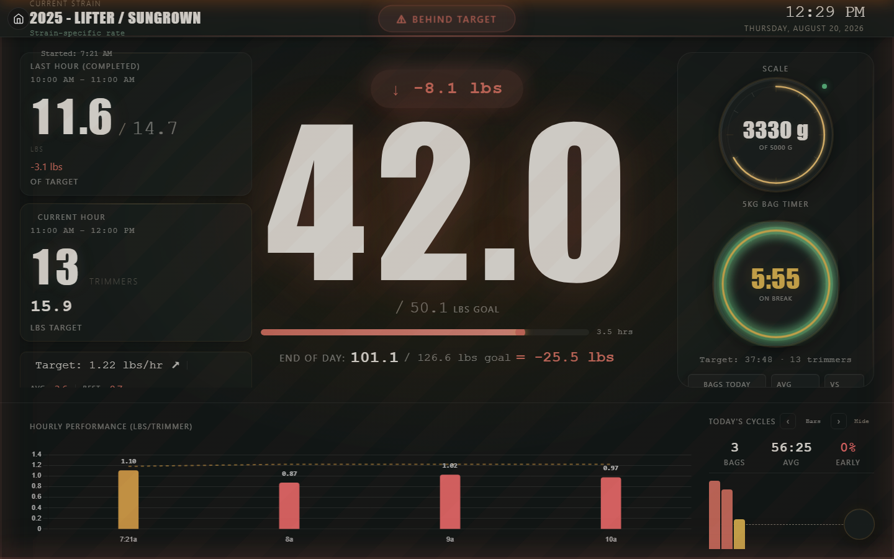
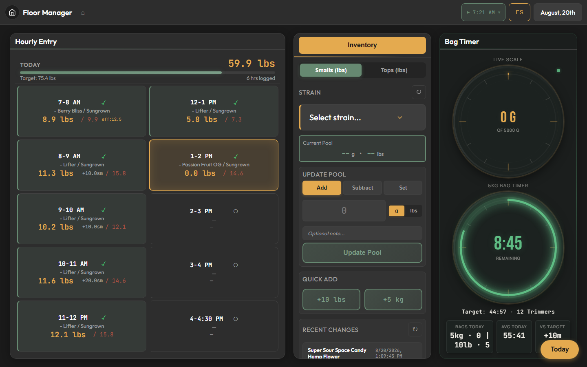
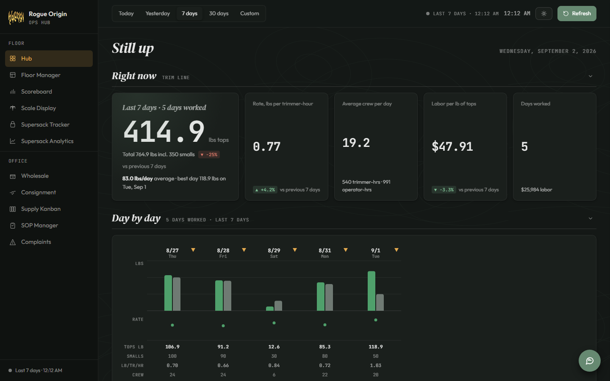
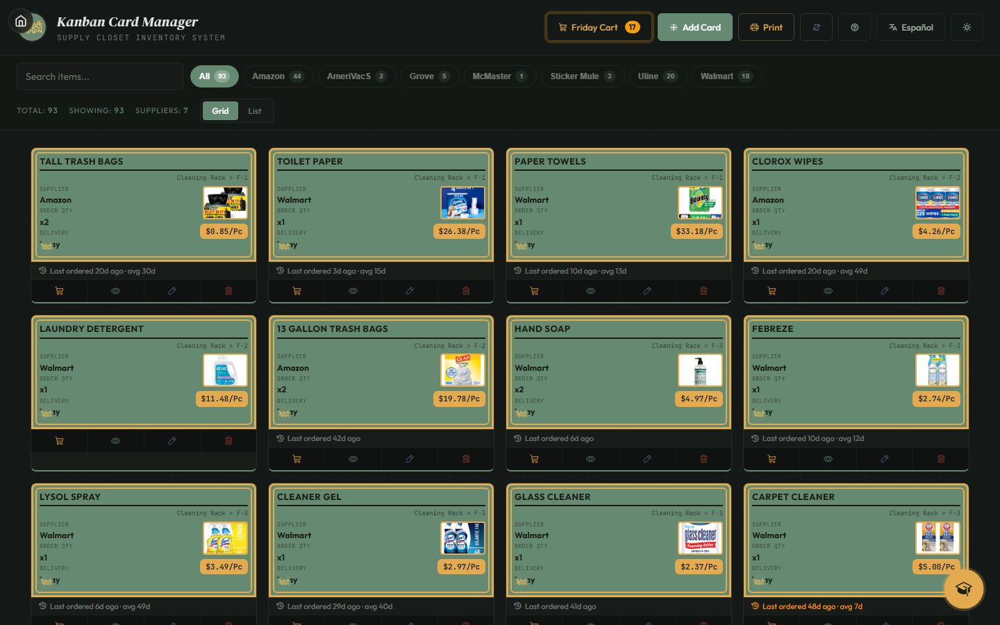
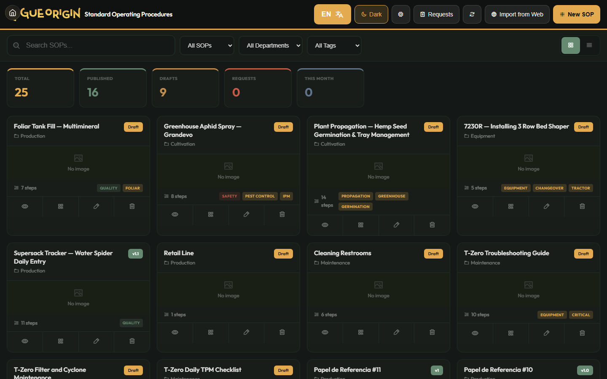

# Rogue Origin Apps

[](https://github.com/RogueFF/rogue-origin-apps/actions/workflows/test.yml)

Operations hub for [Rogue Origin](https://rogueorigin.com) — a seed-to-sale hemp flower business in Southern Oregon. Production tracking, order management, inventory, compliance, and an AI-assisted operations command center.

**Live:** [rogueff.github.io/rogue-origin-apps](https://rogueff.github.io/rogue-origin-apps)

---

## What it looks like

These are the screens the crew actually works from, running live.

### Production Scoreboard



A wall display on the production floor. The day's running total sits against
the goal, with the current hour's pace, the 5 kg bag timer, and lbs-per-trimmer
for every hour worked. It is built to be read across a room — large type, colour
that shifts as the shift falls behind, and a layout that stays legible from the
far end of the line. It refreshes itself and keeps working through a dropped
connection.

### Floor Manager



Where the line lead logs the hour: crew counts per line, cultivar, and tops and
smalls weights. The bag timer and pool inventory live on the same screen, so
nobody switches apps mid-shift. Bilingual, because the floor is.

### Ops Hub



The foreman's view. Pace against today's target, an hour-by-hour shift ledger
with the crew changes and QC notes on it, the order queue and what it is short
of, a watchlist of things that need a person, and the 30-day trend. Every
figure carries its change against the equivalent prior period.

### Supply Kanban



The supply closet as a reorder board. Each card carries its supplier, shelf
location, order quantity and product photo; carts group a week's reordering by
vendor so one person can place them all in a sitting.

### SOP Manager



Standard operating procedures with drafts, departments, tags and embedded
media — versioned, searchable, and bilingual, so a procedure can be pulled up
at the station where it is being done.

---

## Architecture

```
GitHub Pages (Frontend)  ←→  Cloudflare Workers (API)  ←→  Cloudflare D1 (Database)
                                              ↑
                                        Two workers:
                                        • rogue-origin-api (operations)
                                        • mission-control-api (command center)
```

### Stack
- **Frontend:** Vanilla JS, no framework — served via GitHub Pages
- **API:** Cloudflare Workers (two separate workers)
- **Database:** Cloudflare D1 (SQLite at edge)
- **AI Agents:** Node.js scripts orchestrated by Atlas (OpenClaw) via cron
- **CI:** GitHub Actions — tests run on every push

---

## Apps & Pages

| App | Path | Description |
|-----|------|-------------|
| **Ops Hub** | `src/pages/index.html` | Foreman's view of the trim line — live pace against target, an hour-by-hour shift ledger, the order queue, a watchlist, 30-day trend, and an AI assistant |
| **Scoreboard** | `src/pages/scoreboard-v2.html` | Real-time production scoreboard (lbs/hr, crew, targets, order queue) |
| **Floor Manager** | `src/pages/hourly-entry.html` | Hourly production entry — crew counts, bag timer, shift adjustments |
| **Supply Kanban** | `src/pages/kanban.html` | Supply-closet reorder board with vendor carts and reorder alerts |
| **SOP Manager** | `src/pages/sop-manager.html` | Standard operating procedures with versioning and media |
| **Complaints** | `src/pages/complaints.html` | Quality management — customer complaint tracking (EN/ES) |
| **Supersack Tracker** | `src/pages/supersack-entry.html` | Supersack intake and weights |
| **Supersack Analytics** | `src/pages/supersack-analytics.html` | Yield and cost reporting over supersack data |
| **Scale Display** | `src/pages/scale-display.html` | Live scale readout for the weighing station |
| **Consignment** | `src/pages/consignment.html` | Partner farm intake → inventory → payment workflow |
| **Scale Reader** | `scale-reader/` | USB scale integration for weighing stations |

---

## Workers (API)

### `rogue-origin-api`
**Path:** `workers/`
**URL:** `rogue-origin-api.roguefamilyfarms.workers.dev`

Core operations API:
- `/api/production` — real-time production tracking (scoreboard, dashboard, KPIs)
- `/api/supersack` — supersack intake, weights, analytics
- `/api/kanban` — supply reorder board
- `/api/sop` — SOP versioning
- `/api/media` — SOP media upload/serve (R2)
- `/api/complaints` — quality management
- `/api/consignment` — partner farm consignment workflow
- `/api/pool` — Shopify pool inventory proxy
- `/api/irrigation` — irrigation log
- `/api/harvest` — harvest lot ledger
- `/api/orders` — retained for the Scoreboard's order queue and Consignment auth

### `mission-control-api`
**Path:** `workers/mission-control/`
**URL:** `mission-control-api.roguefamilyfarms.workers.dev`

Atlas OS backend:
- `/api/agents` — agent fleet status (register, update, query)
- `/api/activity` — activity feed (all agent actions logged here)
- `/api/tasks` — task management (neural task board)
- `/api/inbox` — decision inbox
- `/api/briefs` — daily operations briefs
- `/api/notifications` — desktop notification feed
- `/api/widgets` — dashboard widget config
- `/api/github` — GitHub proxy (commits, CI, issues, PRs)

---

## Atlas OS (Mission Control)

The command center. A single-page app with draggable, resizable windows:

- **Activity Feed** — real-time log of all agent actions
- **Agent Fleet** — status of every agent (active/idle/error)
- **Neural Tasks** — interactive task graph with domain clustering
- **Inbox** — items requiring Koa's decision
- **Production** — live scoreboard with auto-refresh (60s on shift, 5m off)
- **Atlas Chat** — direct AI chat interface
- **GitHub** — commits, CI status, issues, PRs, branch activity

---

## Agent Squad

Long-running agents report into Mission Control. The agents themselves are
deployed outside this repo; what lives here is the reporting contract they
speak and the fleet registry they write to.

| Piece | Path | Role |
|-------|------|------|
| **Status reporter** | `tools/agents/status.js` | `agentStart` / `agentDone` / `agentError` — writes agent state to `/api/agents` |
| **Fleet registry** | `workers/mission-control/` | `agents` + `activity` tables — who is running, what they last did |
| **Notifications** | `tools/atlas-notifications/` | Electron tray app that surfaces briefs and alerts on the desktop |
| **Card image checker** | `tools/kanban-image-check/` | Health-checks kanban card image URLs and auto-repairs recoverable ones |

---

## Database Schema

### Operations DB (`rogue-origin-api`)
- `monthly_production` / `shift_adjustments` / `pause_log` — shift tracking, hourly logs
- `supersack_entries` — supersack intake and weights
- `inventory_adjustments` — running inventory movements
- `kanban_cards` / `kanban_orders` / `kanban_reorder_requests` — supply reorder board
- `sops` / `sop_requests` — standard operating procedures
- `complaints` — quality management
- `consignment_*` — partner intakes, sales, payments
- `orders` / `shipments` — read by the Scoreboard's order-queue panel
- `harvest_*` / `irrigation_log` — field operations

### Mission Control DB (`mission-control-api`)
- `agents` — fleet registry (name, domain, status, color)
- `activity` — activity feed (every agent action)
- `tasks` — task board with status/priority/domain
- `inbox` — decision items
- `briefs` — daily operations briefs
- `notifications` — desktop notification queue
- `agent_files` — agent deliverables and config storage

---

## Development

### Prerequisites
- Node.js 22+
- Cloudflare account with Wrangler CLI authenticated
- GitHub CLI (`gh`) authenticated

### Local Development
```bash
# Install dependencies
npm install

# Run operations worker locally
cd workers && npx wrangler dev

# Run mission control worker locally
cd workers/mission-control && npx wrangler dev

# Run tests
npm test
```

### Deployment
```bash
# Operations API
npx wrangler deploy --config workers/wrangler.toml

# Mission Control API
npx wrangler deploy --config workers/mission-control/wrangler.toml

# Frontend (GitHub Pages)
git push origin master  # Auto-deploys via GitHub Pages
```

### Testing
```bash
npm test                    # Unit tests — node:test, 155 tests, no network or browser
npm run test:e2e            # End-to-end tests — Playwright (needs browsers + a served app)
npm run playwright:install  # One-time browser download for the E2E suite
```

CI runs `npm test` plus `npm run stamp:check` on every push and pull request.

---

## Project Structure

```
rogue-origin-apps/
├── src/pages/                  # Frontend apps (HTML + JS)
│   ├── index.html              # Dashboard / operations hub
│   ├── scoreboard-v2.html      # Production scoreboard
│   ├── hourly-entry.html       # Floor Manager
│   ├── kanban.html             # Supply Kanban
│   └── ...                     # SOP, complaints, supersack, consignment
├── workers/                    # Cloudflare Workers
│   ├── src/                    # Operations API
│   │   ├── index.js            # Router + handlers
│   │   └── handlers/           # Domain handlers (production, orders, etc.)
│   ├── mission-control/        # Mission Control API
│   │   ├── src/index.js        # Router + all handlers
│   │   └── schema.sql          # D1 schema
│   └── migrations/             # D1 migrations
├── tools/                      # Agent status reporter, notifications, build tooling
├── tests/                      # Test suite
├── scale-reader/               # USB scale integration
├── docs/                       # Design docs, plans, technical docs
└── scripts/                    # Utility scripts
```

---

## Philosophy

- **LEAN / Kaizen** — continuous improvement is the operating system, not a buzzword
- **No framework loyalty** — use whatever's best for the job
- **Ship production-grade** — no "good enough for now"
- **Agents do the work** — Atlas orchestrates, subagents execute

---

*Built and maintained by Atlas + Koa at Rogue Origin.*
